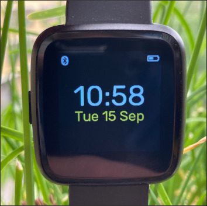

# Hypnos

This is a [Zephyr](https://www.zephyrproject.org/)-based firmware for the
[PineTime](https://www.pine64.org/pinetime/) and P8 smartwatches.



> **Hypnos**, son of Night and Darkness</br>
> He is said to be a calm and gentle god, as he helps humans in need and, due to their sleep, owns
> half of their lives.<sup>[1](https://en.wikipedia.org/wiki/Hypnos)</sup>

## Features and roadmap

- [x] 100 % Free Software
- [x] Battery life: about one week
- [x] Battery status: get state of charge and whether it's charging
- [x] Clock: accurately increment current time
- [x] Time and date synchronization with Bluetooth-connected device
- [x] Touch sensor: tap to light up the display, swipe to display version information
- [x] LVGL graphics: show time, date, battery and Bluetooth status
- [x] Support for the PineTime bootloader
- [x] Over-the-air firmware updates (SMP over BLE)
- [x] Optional debug output via JLink RTT
- [ ] Show notifications from Bluetooth-connected device
- [ ] Set alarm
- [ ] Wrist vibration
- [ ] Quick glance via lift-to-wake

## Developer getting started guide

This document assumes that you run a GNU/Linux or Mac operating system.

### Set up the development environment

Follow Zephyr's [Getting Started
Guide](https://docs.zephyrproject.org/latest/getting_started/index.html) up to
step 3.2 "Get the Zephyr source code". Here you should run the commands below
instead of the ones in the guide:

```
$ git clone https://github.com/endian-albin/pinetime-hypnos
$ cd pinetime-hypnos
$ west init -l app/
$ west update
```

Then complete the remaining steps under section 3 and 4. Finally, run `make
tools`.

### Build and flash Hypnos

Run `make` to build everything with the defaults or `make help` to view all the
options and targets.

Then connect your in-circuit programmer and run `make flash`. To install
without a programmer, see Firmware updates below.

### Build and flash the bootloader

To install or upgrade the bootloader, follow Lup Yuen's [build
instructions](https://lupyuen.github.io/pinetime-rust-mynewt/articles/mcuboot#build-and-flash-mcuboot-bootloader)
or [fetch the prebuilt
binary](https://github.com/lupyuen/pinetime-rust-mynewt/releases/tag/v5.0.4).

Then flash it to the beginning of the internal memory:
```
pyocd flash -e sector -t nrf52 bootloader-image.bin
```

## Firmware updates

### SMP over Bluetooth LE

Hypnos supports firmware image management over the Simple Management Protocol.

To make use of this feature, get the
[mcumgr](https://github.com/apache/mynewt-mcumgr#command-line-tool) command-line
tool. Then run the commands below to list, upload, test and confirm firmware
images over BLE:

```
# mcumgr --conntype="ble" --connstring ctlr_name=hci0,peer_name='Hypnos' image list
# mcumgr --conntype="ble" --connstring ctlr_name=hci0,peer_name='Hypnos' image upload hypnos-mcuboot-app-img.bin
# mcumgr --conntype="ble" --connstring ctlr_name=hci0,peer_name='Hypnos' image test <hash of slot-1 image>
# mcumgr --conntype="ble" --connstring ctlr_name=hci0,peer_name='Hypnos' reset
# mcumgr --conntype="ble" --connstring ctlr_name=hci0,peer_name='Hypnos' image confirm
```

If you are unhappy with the new image, simply run the `reset` command again
instead of `image confirm` to revert to the old one. If the image has already
been confirmed but you still want to revert, simply run the commands above but
skip the upload step or perform a manual rollback (see below). [See this
document for more
information](https://docs.zephyrproject.org/latest/samples/subsys/mgmt/mcumgr/smp_svr/README.html).

### DFU over Bluetooth LE

To install Hypnos over the air from
[InfiniTime](https://github.com/JF002/Pinetime), run `make dfu` to create a
(Nordic) DFU package and upload it using
[ota-dfu.py](https://github.com/JF002/Pinetime/tree/master/bootloader/ota-dfu-python)
or nRF Connect.

### Manual rollback

Version 5 of Lup Yuen's bootloader allows you to revert to the old firmware
image by holding the button during boot.

## Copying

This software may be used under the terms of the Apache License 2.0, unless
explicitly stated otherwise.

The documentation contained in this README and on the wiki are under the CC
BY-SA 4.0 license.
