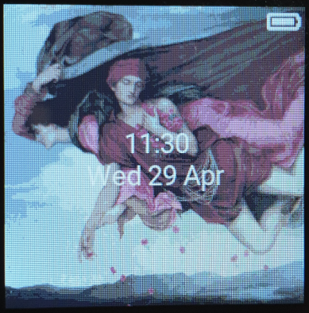

# PineTime Hypnos

This is a work-in-progress [Zephyr](https://www.zephyrproject.org/)-based firmware for the
[PineTime](https://www.pine64.org/pinetime/) smartwatch focused on low power consumption.

It started as a fork of najnesnaj's [firmware toolkit](https://github.com/najnesnaj/pinetime-zephyr)
and is inspired by [PineTime Hermes](https://github.com/Dejvino/pinetime-hermes-firmware).



> **Hypnos**, son of Night and Darkness</br>
> He is said to be a calm and gentle god, as he helps humans in need and, due to their sleep, owns
> half of their lives.<sup>[1](https://en.wikipedia.org/wiki/Hypnos)</sup>

## Features

- [x] 100 % Free Software
- [x] Low power consumption: 1.38 mA in idle mode (1.28 mA with the heart rate sensor disconnected), which gives a battery life of about one week.
- [x] Battery status: get state of charge and whether it's charging
- [x] Clock: accurately increment current time
- [x] Button: press to toggle time synchronization with Bluetooth-connected device
- [x] Touch sensor: tap to light up the display
- [x] Graphics: show background image, time, date, battery and Bluetooth status using LittlevGL
- [x] Optional debug output via JLink RTT
- [ ] Show notifications from Bluetooth-connected device
- [ ] Set alarm
- [ ] Wrist vibration
- [ ] Firmware update over Bluetooth
- [ ] Quick glance via lift-to-wake (requires a free driver for the accelerometer)
- [ ] Step counting (see above)

## Getting started

Follow Zephyr's [Getting Started Guide](https://docs.zephyrproject.org/latest/getting_started/index.html)
up to step 3) "Get the source code". Here you should run the commands below
instead of the ones in the guide:

```
$ mkdir ~/pinetime-hypnos
$ cd ~/pinetime-hypnos
$ west init -m https://github.com/endian-albin/pinetime-hypnos
$ west update
```

Then complete the remaining steps.

Optionally disable logging to save system resources:
```
$ export LOGGING="off"
```

Build and install the application:

```
$ west build -b pinetime hypnos
$ west flash
```

## Copying

All source code in this repository may be redistributed under the
Apache 2.0 license, unless explicitly stated otherwise. Certain
dependencies are under the MIT/X11, 3-clause BSD or similar permissive
licenses.

The documentation contained in this README and on the wiki are under
the CC BY-SA 4.0 license.
